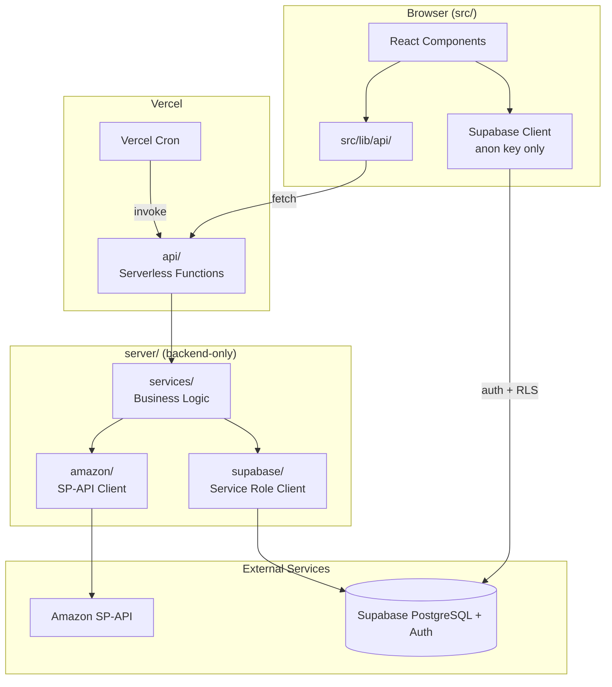
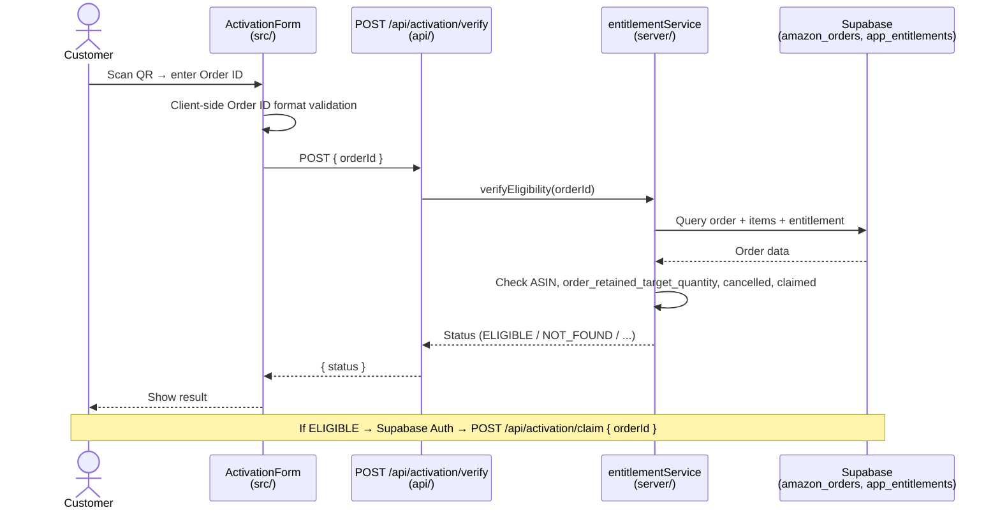
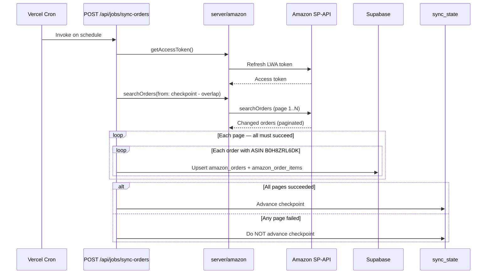

# SignMaster Architecture

This document describes how the SignMaster companion application is structured today, how it is intended to evolve, and the rules future contributors (including AI-assisted development) must follow.

Read this file **before** implementing new features.

---

## Architecture at a glance

| Layer | Technology | Role |
|-------|------------|------|
| **Frontend** | React + Vite | Browser application — UI, client-side format validation, API client calls |
| **Backend** | Vercel Serverless Functions | HTTP handlers in `api/` — request parsing and server-side request validation; delegates to `server/services/` for authoritative business logic |
| **Database / Auth** | Supabase | PostgreSQL for orders and entitlements; Supabase Auth for user identity |
| **Amazon** | SP-API (server-side only) | Scheduled synchronization — **never** called during customer activation |

**Activation path:** Browser → Vercel API → Supabase. **Never** Browser → Amazon.

**Secrets:** Amazon credentials, Supabase service-role key, and all server secrets live in Vercel environment variables only. Never in browser code.

---

## Project purpose

SignMaster is a companion learning application for customers who purchase the **SignMaster 101 UK Road Sign Flashcards** from Amazon UK.

| Item | Value |
|------|-------|
| Target Amazon ASIN | `B0H8ZRL6DK` |
| Production URL | https://signmastercards.co.uk |

The app helps verified purchasers activate their entitlement, create an account, and access learning features (quiz, practice, progress tracking).

---

## Technology decisions

### Frontend

| Technology | Purpose |
|------------|---------|
| **React 19** | UI components and application state |
| **TypeScript** | Type safety across the codebase |
| **Vite** | Dev server, build tooling, and fast HMR |
| **Tailwind CSS** | Utility-first styling |
| **React Router** | Application routing *(planned — not yet installed)* |

### Backend

| Technology | Purpose |
|------------|---------|
| **Vercel Serverless Functions** | HTTP handlers in `api/` — parse requests, validate input, return responses |
| **Monorepo layout** | Backend lives in the same repository as the frontend |
| **`server/services/`** | Authoritative business logic — entitlement rules, sync orchestration, claim transactions |
| **`server/` folder (other)** | Reusable backend-only infrastructure — Amazon client, Supabase service-role client |

### Database

| Technology | Purpose |
|------------|---------|
| **Supabase PostgreSQL** | Orders, entitlements, sync checkpoints, and related data |

### Authentication

| Technology | Purpose |
|------------|---------|
| **Supabase Auth** | User identity (sign up, sign in, sessions) |

**Important:** Authentication and product entitlement are **separate concepts**. A user can exist in Supabase Auth without an active entitlement, and entitlement can be revoked without deleting the auth account.

### Amazon

| Rule | Detail |
|------|--------|
| API | Amazon Selling Partner API (SP-API) |
| Execution | **Server-side only** — never in the browser |
| Credentials | Never exposed to frontend code |
| Primary sync | `searchOrders` for recently changed UK FBA orders |
| Returns sync | `GET_FBA_FULFILLMENT_CUSTOMER_RETURNS_DATA` via Amazon Reports API |
| Reconciliation | All Orders by Last Update report — rolling daily/weekly safety pass *(not primary sync)* |
| Filtering | Only order items matching ASIN `B0H8ZRL6DK` are persisted |
| Returns | FBA customer returns synchronized separately via Reports API |

### Scheduled jobs

| Rule | Detail |
|------|--------|
| Trigger | Vercel Cron invokes server-side sync endpoints |
| Customer activation | **Must NOT** call Amazon SP-API live |
| Activation check | Reads the local Supabase entitlement/order database only |

### Testing

| Tool | Purpose |
|------|---------|
| **Vitest** | Unit tests and test runner |
| **React Testing Library** | Component tests |
| **Playwright** | End-to-end (E2E) tests in `e2e/` — installed and configured; runs locally via `npm run test:e2e` *(not yet in CI)* |

Every new feature or behaviour change must include appropriate automated tests.

---

## Current frontend architecture

This section describes the **existing** React/Vite project as it exists in the repository today.

### Repository layout (current)

```
signmaster-web-app/
├── index.html                 # HTML shell
├── vite.config.ts             # Vite dev/build config (port 4200)
├── vitest.config.ts           # Test runner config
├── tailwind.config.js         # Tailwind theme and breakpoints
├── postcss.config.js          # PostCSS pipeline
├── package.json
├── public/
│   └── vite.svg
└── src/
    ├── main.tsx               # React entry point
    ├── App.tsx                # Top-level app shell and step routing
    ├── vite-env.d.ts          # TypeScript declarations (e.g. PNG imports)
    ├── assets/                # Static assets (logo, images)
    ├── components/
    │   ├── layout/
    │   │   └── PageShell.tsx  # Shared full-page wrapper
    │   └── ui/                # Shared UI primitives (placeholder)
    ├── features/
    │   ├── activation/        # Purchase verification flow
    │   └── account/           # Account creation flow
    ├── styles/
    │   └── globals.css        # Tailwind directives + base styles
    └── test/
        ├── setup.ts           # Vitest + jsdom setup
        └── App.test.tsx       # App-level smoke tests
```

**Also present today:** `api/` (activation verify endpoint), `server/` (Amazon sync, Supabase service-role access, activation verification), `e2e/` (Playwright), and `supabase/` (local schema migrations).

**Not yet present:** `src/lib/`, React Router, Supabase browser client, production cron/job API endpoints.

### Render flow

The application boots through a simple, linear chain:

```
index.html
  └── loads /src/main.tsx
        └── createRoot(...).render(<App />)
              └── App.tsx decides which screen to show
                    ├── ActivationForm.tsx        (activation step)
                    ├── CreateAccountScreen.tsx   (account step)
                    └── CreateAccountScreen       (success / complete step)
                          └── child components (SignMasterLogo, FieldError, HelpOverlay, etc.)
```

#### Step-by-step

1. **`index.html`** — Minimal HTML document. Contains `<div id="root">` and a script tag pointing to `src/main.tsx`. Loads Inter from Google Fonts.

2. **`src/main.tsx`** — Creates the React root, wraps the app in `<StrictMode>`, imports global CSS, and renders `<App />`.

3. **`src/App.tsx`** — Top-level orchestrator. Uses React `useState` to track the current step:
   - `'activation'` → show `ActivationForm`
   - `'create-account'` → show `CreateAccountScreen`
   - `'complete'` → show `CreateAccountScreen` success state

   Initial step is derived from `localStorage` keys on first render.

4. **Feature components** — Each screen lives under `src/features/<feature>/components/`. Feature-specific logic is co-located in `utils/`, `types/`, and `__tests__/`.

5. **Child components** — Reusable pieces within a feature (e.g. `FieldError`, `SignMasterLogo`, `HelpOverlay`) or shared across features via `src/components/`.

### Feature folder pattern

Each feature follows this structure:

```
src/features/<feature-name>/
├── components/       # React UI for this feature
├── hooks/            # Custom React hooks (placeholder in activation)
├── utils/            # Pure functions (validation, formatting)
├── types/            # TypeScript interfaces and constants
└── __tests__/        # Component and utility tests
```

**Existing features:**

| Feature | Key files | Purpose |
|---------|-----------|---------|
| `activation` | `ActivationForm.tsx`, `validation.ts`, `formatting.ts` | Amazon order ID verification UI *(prototype also collects postcode — see note below)* |
| `account` | `CreateAccountScreen.tsx`, `validation.ts` | Email/password registration UI |

### Components

| Location | Role |
|----------|------|
| `src/features/*/components/` | Feature-specific UI (forms, screens, overlays) |
| `src/components/layout/` | Shared layout wrappers (`PageShell.tsx`) |
| `src/components/ui/` | Shared UI primitives *(placeholder — empty)* |

Components should remain focused on rendering and user interaction. Business rules belong in `utils/`; API calls will belong in `lib/` (see Target architecture).

### Utils

Pure, testable functions with no React or DOM dependencies:

| File | Examples |
|------|----------|
| `activation/utils/validation.ts` | `isValidOrderId()`, `isValidPostcode()` *(postcode: prototype only)* |
| `activation/utils/formatting.ts` | `formatOrderId()`, `normalisePostcode()` *(postcode: prototype only)* |
| `activation/utils/motion.ts` | `prefersReducedMotion()` |
| `account/utils/validation.ts` | `isValidEmail()`, `isValidPassword()` |
| `account/utils/fieldStyles.ts` | Tailwind class helpers for input states |

### TypeScript types

Types live in `src/features/<feature>/types/index.ts`:

```typescript
// activation/types/index.ts
export interface ActivationFormProps { onSuccess?: () => void }
export const ACTIVATION_STORAGE_KEY = 'signmaster_activated'
export type ActivationStatus = 'idle' | 'loading' | 'failed'

// account/types/index.ts
export interface CreateAccountScreenProps { onComplete?: () => void; onSignIn?: () => void }
export const ACCOUNT_STORAGE_KEY = 'signmaster_account_created'
```

Shared types will eventually move to `src/lib/types/` as the app grows.

### Tailwind styling

- **Config:** `tailwind.config.js` defines theme colours (`background`, `accent`, `error`, `success`), gradients, breakpoints (`xs: 375px` through `xl: 1280px`), and Inter as the default sans font.
- **Global styles:** `src/styles/globals.css` imports Tailwind directives (`@tailwind base/components/utilities`), sets base body styles, and defines responsive component classes (e.g. `.activation-subtitle`).
- **Usage:** Components apply Tailwind utility classes directly in JSX. No CSS-in-JS.

### React state and event flow

State is managed with React hooks (`useState`, `useRef`, `useCallback`). There is no global state library yet.

**Example: ActivationForm submit flow (current prototype behaviour)**

> **Prototype note:** The current UI also collects a delivery postcode and validates it client-side. Postcode is **not** part of the target production activation flow and **will be removed** when the real `/api/activation/verify` integration is implemented. Production activation uses **Amazon Order ID only**.

```
User clicks "Verify Order & Continue"
  └── handleSubmit(event)
        ├── event.preventDefault()
        ├── setSubmitAttempted(true)
        ├── Client-side validation (isValidOrderId, isValidPostcode)   ← postcode: prototype only
        │     └── if invalid → focus first bad field, stop
        ├── setStatus('loading')
        ├── await simulated delay (1.8s)          ← prototype only
        ├── if demo failure pattern → setStatus('failed')
        └── else → localStorage.setItem(...), onSuccess()
              └── App.tsx setStep('create-account')
```

**Example: CreateAccountScreen submit flow (current prototype behaviour)**

```
User clicks "Create Account & Continue"
  └── handleSubmit(event)
        ├── Client-side validation (email, password rules, confirm match)
        ├── setFormStatus('loading')
        ├── await simulated delay (1.8s)          ← prototype only
        ├── if demo existing-account email → show alert
        └── else → localStorage.setItem(...), onComplete()
              └── App.tsx setStep('complete')
```

> **Note:** The current implementation uses `localStorage` and simulated delays as UI prototypes. The target architecture replaces these with real API calls and Supabase (see Activation architecture below).

---

## Responsive design and browser compatibility

SignMaster is **one responsive React web application**. These requirements apply to all current and future UI work.

### Single application, responsive layout

1. There must **not** be separate mobile and desktop applications, or duplicated mobile/desktop feature implementations, unless there is a documented and justified exception.
2. The application must work well in both **desktop and mobile browsers**.
3. Use a **mobile-first** responsive design approach — base styles target small screens; larger breakpoints add enhancement.
4. UI must adapt across **mobile, tablet, and desktop** widths.
5. Avoid fixed-width layouts that cause horizontal scrolling on common device sizes.

### Usability on small screens

6. Forms, cards, navigation, dialogs, overlays, and learning activities must remain **usable on small mobile screens** (from ~375px wide upward).
7. Interactive controls must work with **touch**, **mouse**, and **keyboard**.
8. Do **not** make important functionality available only through hover — hover may enhance but must not gate access.
9. Text and controls must remain readable and accessible **without requiring horizontal zooming**. Input font sizes should be ≥ 16px on mobile where needed to avoid browser auto-zoom (see existing activation form patterns).

### Browser support

10. Target **modern browsers**:

    | Platform | Browsers |
    |----------|----------|
    | Desktop | Chrome, Edge, Firefox, Safari |
    | Mobile | Safari on iOS, Chrome on Android |

11. Avoid browser-specific functionality unless an **appropriate fallback** exists for unsupported browsers.

### Tailwind implementation

12. Keep the existing Tailwind breakpoint strategy defined in `tailwind.config.js`:

    | Breakpoint | Min width |
    |------------|-----------|
    | `xs` | 375px |
    | `sm` | 640px |
    | `md` | 768px |
    | `lg` | 1024px |
    | `xl` | 1280px |

    Use **responsive Tailwind utilities** (e.g. `text-base sm:text-sm`, `px-4 md:px-8`, `max-w-md w-full`) rather than creating duplicated mobile/desktop components.

---

## Target folder architecture

Core backend folders (`api/`, `server/`, `e2e/`) now exist. Some endpoints and jobs below remain planned.

This is the intended structure as the application matures:

```
signmaster-web-app/
├── src/                          # Browser-safe frontend code ONLY
│   ├── components/               # Shared UI and layout components
│   ├── features/
│   │   ├── activation/           # Purchase verification UI
│   │   ├── account/              # Registration / sign-in UI
│   │   ├── learn/                # Learning content screens
│   │   ├── practice/             # Quiz / practice mode
│   │   └── progress/             # User progress tracking
│   └── lib/                      # Frontend utilities
│       ├── api/                  # Typed API client functions
│       ├── supabase/             # Supabase browser client (anon key only)
│       └── types/                # Shared frontend types
│
├── api/                          # Vercel serverless HTTP endpoints
│   ├── activation/
│   │   ├── verify.ts             # POST — check order eligibility (implemented)
│   │   └── claim.ts              # POST — atomically claim entitlement *(planned)*
│   └── jobs/
│       ├── sync-orders.ts        # Cron — incremental order sync *(planned)*
│       ├── sync-returns.ts         # Cron — FBA returns via Reports API *(planned)*
│       └── reconcile-orders.ts     # Cron — rolling reconciliation *(planned)*
│
├── server/                       # Reusable backend-only logic
│   ├── amazon/                   # SP-API client, token refresh
│   ├── supabase/                 # Service-role Supabase client
│   └── services/                 # Business logic (entitlement, sync)
│
└── e2e/                          # Playwright end-to-end tests
```

### Folder responsibilities

| Folder | Runs in | Contains | Must NOT contain |
|--------|---------|----------|------------------|
| `src/` | Browser | React components, hooks, client-side validation, API client wrappers | Secrets, SQL, Amazon calls, service-role Supabase |
| `api/` | Vercel server | Thin HTTP handlers — parse requests, server-side request validation, call `server/services/`, return responses | Authoritative business logic (belongs in `server/services/`) |
| `server/` | Vercel server | Amazon integration, Supabase service-role access, business logic in `services/` | React components, browser APIs |
| `e2e/` | CI / local | Full user-journey tests via Playwright | Unit tests (those live next to source) |

### Import boundary (critical)

```
✅  src/ → src/lib/api/activationApi.ts → fetch('/api/activation/verify')
✅  api/activation/verify.ts → server/services/activationVerification.ts
❌  src/ → server/                     (NEVER import server code in frontend)
❌  src/ → api/                        (NEVER import API handlers in frontend)
```

Backend/server modules must **never** be imported into frontend/browser code.

---

## Activation architecture

### Target flow

```
Customer scans QR code on product packaging
  → opens https://signmastercards.co.uk/activate
  → ActivationForm renders
  → customer enters Amazon Order ID
  → frontend validates Order ID format (instant UX feedback)
  → frontend calls POST /api/activation/verify  { orderId }
  → backend validates format again
  → backend queries local Supabase database (NOT Amazon SP-API)
  → checks:
      • target ASIN B0H8ZRL6DK exists on the order
      • order_retained_target_quantity > 0
      • order is not cancelled
      • order has not already been claimed
  → returns activation status to frontend
```

**Per-item retained quantity** (building block):

```
retained_fulfilled_quantity = max(quantity_fulfilled - quantity_returned, 0)
```

**Order-level eligibility** is evaluated across **all matching target-ASIN order items** on the Amazon order:

```
order_retained_target_quantity =
  SUM(retained_fulfilled_quantity)
  for all order items where asin = B0H8ZRL6DK
```

Activation requires `order_retained_target_quantity > 0` — meaning at least one unit that was actually fulfilled/shipped remains unreturned across all target-ASIN line items. If no target-ASIN items have been fulfilled, `order_retained_target_quantity = 0` and the order is not yet eligible (`NOT_SHIPPED`).

### Activation statuses

| Status | Meaning | Frontend action |
|--------|---------|-----------------|
| `ELIGIBLE` | Order verified, ready to claim | Proceed to account creation |
| `NOT_FOUND` | Order ID not in local database | Show "order not found" message |
| `NOT_SHIPPED` | Order exists but not yet fulfilled | Show "not yet shipped" message |
| `ALREADY_CLAIMED` | Another account claimed this order | Show "already claimed" message |
| `CANCELLED` | Order was cancelled | Show "order cancelled" message |
| `RETURNED` | All fulfilled target-ASIN units returned (`order_retained_target_quantity = 0`) | Show "order returned" message |
| `ERROR` | Unexpected server failure | Show generic error + support link |

### Claim flow (after ELIGIBLE)

```
Customer creates or signs into Supabase Auth account
  → frontend calls POST /api/activation/claim  { orderId }
  → backend security (all mandatory):
      • requires authenticated Supabase session (valid JWT)
      • derives user_id server-side from the session — NEVER trusts user_id from browser
      • does NOT trust an earlier /verify result (verify is advisory for UX only)
      • runs authoritative eligibility re-check + entitlement INSERT in a single DB transaction/RPC where practical:
          - read current order/item state
          - verify order_retained_target_quantity > 0
          - verify order is not cancelled
          - verify entitlement is unclaimed
          - INSERT app_entitlements for the authenticated user
      • UNIQUE(amazon_order_id) remains final race-condition protection for concurrent claims
  → on success:
      • links entitlement to authenticated user_id
      • sets status = 'active', claimed_at = now()
  → entitlement becomes active
  → customer enters companion application (learn / practice / progress)
```

### Claim endpoint security rules

| Rule | Detail |
|------|--------|
| Authentication required | Request must include a valid Supabase Auth session token |
| `user_id` source | Derived server-side from authenticated session only |
| Never trust client `user_id` | Browser-supplied user identifiers are ignored |
| Re-verify eligibility | Full entitlement checks re-run at claim time, independent of `/verify` |
| Transactional claim | Eligibility re-check and `app_entitlements` INSERT occur in a single database transaction or Supabase RPC where practical |
| Transaction steps | Read order state → verify `order_retained_target_quantity > 0` → verify not cancelled → verify unclaimed → insert entitlement |
| Double-claim protection | `UNIQUE(amazon_order_id)` on `app_entitlements` — final safeguard against concurrent claims |

### Completion / finalisation flow (after successful claim)

`/claim` deliberately leaves the activation context **valid** after `SUCCESS` so a lost claim response can be safely retried (Task 5 idempotency). A separate finalisation step closes the activation lifecycle once the user has reached the success state.

```
Success claim state reached in the browser
  → user clicks Continue
  → frontend calls POST /api/activation/complete   (no body; Bearer token + HttpOnly cookie)
  → api/activation/complete.ts (thin handler):
      • require authenticated Supabase session (Bearer token → user_id server-side)
      • require confirmed email (email_confirmed_at)
      • read the activation-context token from the HttpOnly cookie ONLY
      • delegate to server/services/activationCompletionService.ts
  → activationCompletionService.finalizeActivationCompletion:
      • resolve context from the cookie token (no expiry touch/refresh)
      • confirm the entitlement for that order exists, is owned by the user, and is active
      • invalidate the activation context server-side
  → on COMPLETED: clear the HttpOnly activation-context cookie (Set-Cookie, Max-Age=0)
  → return a safe status only: { status: 'COMPLETED' | 'NO_CONTEXT' | 'NOT_ELIGIBLE'
                                 | 'EMAIL_NOT_CONFIRMED' | 'UNAUTHENTICATED' }
```

The response body never contains the Amazon Order ID, the context token, or entitlement row IDs. Completion never transfers or recreates entitlements — it only verifies ownership and tidies up the one-time activation context/cookie.

### Completion endpoint security & idempotency rules

| Rule | Detail |
|------|--------|
| Authentication required | Bearer token validated server-side; `user_id` derived from the session, never from the browser |
| Confirmed email required | `email_confirmed_at` must be set, otherwise `EMAIL_NOT_CONFIRMED` |
| Context source | Activation-context token is read from the HttpOnly cookie only — never from JavaScript or the request body |
| Ownership check | Entitlement must exist, be owned by the authenticated user, and be `active`, otherwise `NOT_ELIGIBLE` |
| Server-side cleanup | Context is invalidated server-side; the cookie is cleared via `Set-Cookie` (JavaScript never clears it) |
| Privacy | Response returns a status enum only — no Order ID, context token, `token_hash`, or entitlement IDs |
| Claim idempotency preserved | On `NOT_ELIGIBLE` the cookie is left intact so Task 5 claim retry idempotency is unaffected |

**Repeated completion semantics (safe to repeat):**

| Situation | Behaviour |
|-----------|-----------|
| First completion — context valid, entitlement owned + active | Invalidate context, clear cookie, return `COMPLETED` |
| Repeat with the cookie already cleared | No cookie to read → return `NO_CONTEXT` (no side effects); the UI keeps showing the activated state |
| Repeat with a stale cookie whose context is invalidated/expired | Resolves to `NO_CONTEXT`; the stale cookie is cleared |
| Cleanup failure (invalidate throws) | Completion errors out with the context/cookie intact so the user can retry — no partial finalisation |

### Completion outcome authority (finalisation is authoritative)

The Task 5 claim `SUCCESS` grants the entitlement, but the completion check re-verifies ownership/active status **at finalisation time** and is authoritative. A stale claim `SUCCESS` must never paper over a negative completion outcome. The continuation view resolver (`src/features/activation/utils/activationContinuation.ts` → `resolveSuccessView`) maps each completion outcome as follows:

| Completion outcome after claim SUCCESS | Continuation view | Shows "activated"? |
|----------------------------------------|-------------------|--------------------|
| `COMPLETED` | `activated` | Yes |
| `NO_CONTEXT` | `activated` | Yes — deliberate recovery: an empty context after a successful claim means finalisation already happened (see repeated-completion semantics above) |
| `NOT_ELIGIBLE` (e.g. entitlement revoked between claim and completion) | `finalize_not_eligible` | **No** — safe access/finalisation failure, no internal reason exposed |
| `EMAIL_NOT_CONFIRMED` | `finalize_email_not_confirmed` | **No** — confirmation/re-auth recovery |
| `UNAUTHENTICATED` | `finalize_unauthenticated` | **No** — sign-in/re-auth recovery |
| `service_unavailable` / `connection_error` | `finalize_retryable_error` | Access stays active; only cleanup is retryable |

`useActivationCompletion` only marks the completion **terminal** (permanently disabling another attempt) for `COMPLETED` and `NO_CONTEXT`. `NOT_ELIGIBLE`, `EMAIL_NOT_CONFIRMED`, `UNAUTHENTICATED`, and transient failures leave completion retryable so the user can recover with an explicit action — there is no automatic retry loop.

### Cross-device / cross-browser confirmation (continuation reference)

The activation-context cookie (Task 4) provides continuity only within the **same browser/device**. Email confirmation that completes in a *different* browser (e.g. the customer opens the confirmation email on their phone) will not carry the HttpOnly cookie. Task 6 closes this gap with a short-lived, opaque, single-use, server-side **continuation reference**.

**Reference lifecycle**

```
Original browser (has activation-context cookie):
  eligible order → activation context created → "Create Account & Continue"
    → POST /api/activation/continuation  (reads context cookie server-side; body: { email })
        → activationContinuationService.createActivationContinuation:
            • resolve context token → amazon_order_id (server-side; no touch/refresh)
            • generate opaque reference (32 random bytes, base64url)
            • store SHA-256(reference) + amazon_order_id + normalised email + expires_at
        → returns the raw reference to the browser
    → signUp(..., { emailRedirectTo: `${origin}/activation/continue?ref=<opaque>` })
    → Supabase sends the confirmation email carrying the opaque ref in the link

Confirming device (any browser; NO original cookie):
  clicks the email link → Supabase establishes the confirmed session (detectSessionInUrl)
    → lands on /activation/continue?ref=<opaque> (ActivationContinueScreen)
    → POST /api/activation/continue  (Bearer token + body: { ref })
        → require authenticated + confirmed session
        → activationContinuationService.consumeActivationContinuation:
            • generate the raw context token app-side (only its hash is stored)
            • call the `consume_activation_continuation` Postgres function, which
              in ONE transaction: SELECT ... FOR UPDATE the reference, verify
              hash/email/not-consumed/not-expired, mark consumed_at, and INSERT
              the fresh activation_context for the same amazon_order_id
        → on CONTINUED: re-issue the HttpOnly activation-context cookie on this device
    → resume to /create-account → resolver sees VALID context + confirmed auth
    → normal Task 5 claim → success (claim rules unchanged)
```

**TTL & single-use**

- TTL: `ACTIVATION_CONTINUATION_LIFETIME_SECONDS` = 30 minutes (`server/activation/continuationReference.ts`).
- Single-use & atomicity: consume and fresh-context creation run in a single transaction (`consume_activation_continuation`). Either both happen (`CONTINUED`) or neither does — if the context insert fails the transaction rolls back and the reference stays unconsumed (the exchange is retryable). Concurrent consumes serialise on a `SELECT ... FOR UPDATE` row lock, so exactly one succeeds and exactly one context is created; the loser resolves to `ALREADY_CONSUMED`. The function is `service_role`-only (execute revoked from `anon`/`authenticated`) and returns a status enum only — never the order id, continuation/context hashes, or database ids. The raw context token is generated app-side so the browser only ever receives the resulting HttpOnly cookie.

**Privacy boundary**

- The browser-visible reference is an opaque random token. It carries **no** Amazon Order ID, activation-context token, `token_hash`, user id, email, or reusable credential.
- The server stores only the SHA-256 hash of the reference (never the raw value), the order id, and the normalised sign-up email as a binding key. All continuation state is resolved server-side.
- The sign-up email is a **binding key only**: the authoritative identity is the confirmed Supabase session at consume time (`email` from the validated Bearer token). A different authenticated user cannot consume another user's reference; mismatches resolve to `INVALID` with no account/order enumeration.
- Consuming a reference only re-establishes an activation *context* (a verified-order pointer). It never grants an entitlement — the entitlement claim still follows the unchanged Task 5 authenticated/confirmed/atomic rules.

**Fallback / recovery**

- Unknown, malformed, expired, already-consumed, or mismatched-email references all resolve to a safe recovery state on `/activation/continue` ("This activation link can't be used" → Sign in / Verify my order). No enumeration.
- No `ref` present, or an unauthenticated confirming device: the screen routes onward (resume when already authenticated, otherwise prompt sign-in), so the **same-browser** path — return to the original tab, click "I've confirmed my email", refresh session, claim — is unaffected. Both paths coexist.

## Password recovery / reset flow

SignMaster uses Supabase Auth's supported recovery-session flow for password reset. Authentication and entitlement stay separate (see *Authentication versus entitlement*): resetting a password never grants, transfers, or recreates an entitlement, and a recovery session is never treated as activation authority.

**Routes**

| Route | Screen | Purpose |
|-------|--------|---------|
| `/forgot-password` | `ForgotPasswordScreen` | Request a reset email (reached via the "Forgot password?" action on `/sign-in`) |
| `/reset-password` | `ResetPasswordScreen` | Dedicated recovery landing route; choose a new password when a recovery session exists |

**Request flow (anti-enumeration)**

```
Sign In → "Forgot password?" → /forgot-password
  → user enters email
  → authService.requestPasswordReset(email, { redirectTo: `${origin}/reset-password` })
      → supabase.auth.resetPasswordForEmail(email, { redirectTo })
  → UI always shows the same generic confirmation:
      "If an account exists for this email, we've sent a password reset link."
```

- Account existence is never revealed. Account-not-found does not error in Supabase, so it collapses to the same `sent` outcome; any unexpected/unclassified error also collapses to `sent`. Only genuine transient failures (rate-limited / service / connection) surface a neutral "try again" state — never an account signal.
- Raw Supabase errors never reach the UI. `authService` maps outcomes to safe categories (`categorisePasswordResetRequestError`).
- The `redirectTo` URL points only at `${origin}/reset-password` with **no** query params — it carries no user id, Amazon Order ID, activation-context token, `token_hash`, or entitlement id. Supabase appends the recovery session itself (`buildPasswordResetRedirect`).

**Reset flow (recovery session)**

```
Recovery email link → Supabase establishes the recovery session (detectSessionInUrl)
  → AuthProvider observes the `PASSWORD_RECOVERY` auth event (isPasswordRecovery = true)
  → lands on /reset-password (ResetPasswordScreen)
  → recovery gate: form shows ONLY when the PASSWORD_RECOVERY event has fired
      (isPasswordRecovery) in this page load; otherwise → safe
      "This reset link can't be used" recovery state
  → user enters New password + Confirm password (existing password rules + match)
  → authService.updatePassword(newPassword) → supabase.auth.updateUser({ password })
  → on success: session remains valid/authenticated → success state → Continue
      → routes to /create-account where the existing activation resolver resumes
        (valid context + confirmed auth → normal Task 5 claim; unchanged)
```

**Recovery-session authority & AuthProvider**

- The single `AuthProvider` `onAuthStateChange` subscription (one source of truth) records the `PASSWORD_RECOVERY` event as `isPasswordRecovery`. This is the only AuthProvider change; it introduces no second competing auth-state resolver.
- Recovery authority originates **only** from Supabase's `PASSWORD_RECOVERY` event. A normal authenticated session is **not** recovery authority: a signed-in user who manually visits `/reset-password` gets the safe recovery state, never the password form (that would be account-settings / change-password, which Task 7 does not implement). User id, email, and activation context are never used as recovery authority.
- A late-arriving `PASSWORD_RECOVERY` event (still within the same page load) flips `checking → ready`, so a genuine recovery entry is never mislabelled invalid due to event/`getSession` ordering.
- **Reload semantics:** the `PASSWORD_RECOVERY` event does not re-fire on reload and cannot be re-derived without unsafe client authority. Rather than weaken the boundary (e.g. treating the persisted session as recovery, or reading tokens from storage), a hard reload of `/reset-password` deliberately falls back to the safe "request a new reset link" state.
- `isPasswordRecovery` grants no entitlement and unlocks no protected content (there is no protected routing yet — Task 8).

**Invalid / expired / used / malformed recovery**

- Missing recovery session, expired/used link, malformed callback, or a signed-out visit to `/reset-password` all resolve to the same safe recovery state: *request a new reset email* or *return to sign in*. No account/email existence is leaked.
- If the recovery session dies mid-submit, `updatePassword` returns `invalid_recovery_session` and the screen falls back to the same safe recovery state.

**Activation continuity**

- Requesting a reset does not touch or invalidate an in-progress activation context, and creates/modifies no entitlement rows.
- After a same-browser reset the user is authenticated again, so the existing resolver continues the journey (`/create-account`).
- Cross-device: the reset link carries no activation authority (no Order ID, no context token). A reset completed on another device simply follows the normal resolver/recovery rules there. Task 6 cross-device activation continuation is unchanged.

## Protected routing (entitlement-aware access)

Access to the protected area is authorised **server-side** by entitlement, not by
the mere presence of a Supabase session. Authentication answers "who are you?";
entitlement answers "are you allowed in?" (see *Authentication versus
entitlement*). The `/app` route is the single guarded entry point and doubles as
the shared **post-auth resolver** every sign-in / account-creation /
activation-success / password-reset "Continue" funnels through.

**Server authority**

```
GET /api/entitlement/me   (Bearer token ONLY)
  → api/entitlement/me.ts (thin handler):
      • derive user_id server-side from the verified Bearer token
        (never from the request body/query)
      • delegate to server/services/entitlementService.checkUserEntitlement
  → entitlementService (service-role authority):
      • query app_entitlements for the user filtered to status = 'active'
      • re-check status = 'active' in code (defence in depth)
  → returns a minimal enum ONLY: { status: 'ACTIVE' | 'NONE' }
    (401 { status:'UNAUTHENTICATED' } with no session; 500 { status:'ERROR' } on failure)
```

- Only `status = 'active'` grants access. Missing/revoked → `NONE`.
- **Fail closed:** any dependency error returns `ERROR` and the client treats it
  as "no access yet" — a transient failure is never mistaken for a definitive
  `NONE`, and access is never granted on error.
- The response never contains an Amazon Order ID, entitlement id, user id,
  timestamps, revocation reason, or database error text.
- Client boundary `src/lib/api/entitlementApi.ts` maps the response to safe
  categories `active | none | unauthenticated | service_unavailable |
  connection_error` (unknown/malformed payloads collapse to
  `service_unavailable`). It sends only the bearer token and no user id.

**Resolver state machine** (`src/lib/routing/protectedRouteResolver.ts`, pure)

Authority is evaluated in order — auth → entitlement → activation context — and
`ProtectedRoute` renders exactly one outcome per pass, so there are never two
competing redirects:

| State | Trigger | Outcome |
|-------|---------|---------|
| `checking_auth` | Auth still initialising | Neutral loading (no protected content) |
| `signed_out` | Not authenticated, or backend rejected the token | Redirect → `/sign-in` |
| `checking_entitlement` | Entitlement lookup in flight | Neutral loading |
| `active` | Entitlement `ACTIVE` | Render protected content |
| `checking_activation_context` | Entitlement `NONE`, context in flight | Neutral loading |
| `resume_activation` | Entitlement `NONE` + **valid** context | Redirect → resume (`/create-account`) |
| `activation_required` | Entitlement `NONE` + no/expired context | Frozen state **B10** |
| `retryable_error` | Entitlement or context lookup failed | Fail-closed retry screen |

- **No protected-content flash:** while any authority is resolving, a neutral
  "Checking your access…" screen renders — the protected content is never shown
  before access is confirmed.
- **Backend authority, no cache:** the entitlement is fetched fresh from the
  backend on every mount. Nothing is read from or written to
  `localStorage`/`sessionStorage`; a revoked entitlement therefore denies access
  on the next navigation, and access does not "stick" across logout/login from a
  browser cache.
- **Revoked = no access:** a revoked row resolves to `NONE` (and then B10 or
  resume, depending on context). The guard never claims or creates an
  entitlement — resuming activation delegates to the existing Task 5 claim flow
  so the claim is never duplicated.

**Frozen state B10 (`ActivationRequiredScreen`)**

| Element | Copy / target |
|---------|---------------|
| Heading | "Finish activating SignMaster" |
| Body | "Your account is ready. Verify your Amazon order to activate access." |
| Primary | "Verify my order" → `/activate` |
| Secondary | "Use another account" → sign out, then `/sign-in` |
| Support | "Get support" (mailto) |

Usable from 375px upward with no horizontal overflow.

**Post-auth resolver integration**

Sign-in, account creation, activation-success "Continue", and password-reset
"Continue" all route to `/app` rather than hardcoding a next screen; the guard
then decides access vs. resume vs. B10. This preserves the Task 7 recovery
authority (a recovery session grants no entitlement — the guard still asks the
backend) and the Task 5/6 claim/completion rules (unchanged).

**Explicitly not implemented here:** Dashboard, Quiz, Learn, Progress, and other
product features. `/app` renders only a minimal "SignMaster access is active."
placeholder proving the routing boundary.

### Current vs target gap

| Aspect | Current (prototype) | Target |
|--------|---------------------|--------|
| Verification | Backend: `POST /api/activation/verify` → Supabase. Frontend: still prototype (simulated delay + localStorage) | Frontend calls `/api/activation/verify`; remove postcode field |
| Input fields | Order ID + postcode | **Order ID only** (postcode removed) |
| Amazon API | Not used | Never called during activation |
| Routing | `App.tsx` step state | React Router `/activate` route |
| Auth | Not integrated | Supabase Auth |
| Claim | localStorage flag | `POST /api/activation/claim` → `app_entitlements` |
| Completion | localStorage `complete` step | `POST /api/activation/complete` → invalidate context + clear cookie |

---

## Authentication versus entitlement

These are intentionally separate systems:

| Concept | System | Question it answers |
|---------|--------|---------------------|
| **Authentication** | Supabase Auth | "Who is this user?" |
| **Entitlement** | `app_entitlements` table | "Is this user allowed to access SignMaster?" |

### Rules

- A user can authenticate (have a Supabase Auth account) without an active entitlement.
- Entitlement is granted by claiming a verified Amazon purchase.
- Entitlement can be **revoked** (returned/cancelled order) without deleting or disabling the Supabase Auth account.
- Revocation sets `app_entitlements.status = 'revoked'`, `revoked_at`, and `revocation_reason`.
- The app checks entitlement status on protected routes/actions, not just auth session presence.

```
User signs in (Supabase Auth)     →  "Who are you?"
App checks entitlement           →  "Are you allowed in?"
```

---

## Amazon synchronization architecture

Amazon data is kept up to date by scheduled server-side jobs, **not** by customer-facing requests.

### Build priority

Implement sync jobs in this order:

1. **`sync-orders`** — primary incremental sync via `searchOrders` *(local foundation implemented in `server/`; production cron endpoint not yet deployed)*
2. **`sync-returns`** — FBA customer returns via Reports API
3. **`reconcile-orders`** — rolling reconciliation safety pass (not primary sync)

### Order sync flow (primary — `searchOrders`)

```
Vercel Cron (scheduled)
  → POST /api/jobs/sync-orders
  → server/amazon: obtain LWA access token (refresh token → access token)
  → read sync_state checkpoint
  → call Amazon searchOrders with overlap before previous successful checkpoint
  → process ALL pages in the requested window (pagination must complete fully)
  → for each order on each page:
      → inspect orderItems
      → keep only items where asin = 'B0H8ZRL6DK'
      → upsert into amazon_orders + amazon_order_items (Supabase)
  → advance sync_state checkpoint ONLY if every page in the window succeeded
  → if any page fails → checkpoint must NOT advance (retry on next run)
```

### Sync checkpoint rules (order sync — paginated APIs such as `searchOrders`)

| Rule | Detail |
|------|--------|
| Overlap window | Query from slightly before the previous successful checkpoint to avoid missing edge-case updates. Exact overlap duration is configurable at implementation time. |
| Full pagination | All pages returned for the requested window must be processed before checkpoint advancement |
| All-or-nothing checkpoint | Checkpoint advances only after **every** page in the window succeeds |
| Failure handling | If any page fails, the checkpoint does not advance; the next run retries from the last successful checkpoint |
| Idempotent writes | Upserts into `amazon_orders` and `amazon_order_items` are idempotent — duplicate results caused by overlap are harmless |

### FBA returns sync flow (`GET_FBA_FULFILLMENT_CUSTOMER_RETURNS_DATA` via Reports API)

This report is **not** paginated like `searchOrders`. It is obtained through Amazon's Reports API as a complete generated document.

```
Vercel Cron (scheduled, separate schedule)
  → POST /api/jobs/sync-returns
  → authenticate scheduled request (see Cron/job endpoint security)
  → server/amazon: obtain LWA access token
  → request/create GET_FBA_FULFILLMENT_CUSTOMER_RETURNS_DATA report
  → wait/poll until report status is generated
  → obtain/download report document
  → parse the complete report
  → filter locally to target ASIN B0H8ZRL6DK
  → update quantity_returned on matching amazon_order_items
  → recalculate order_retained_target_quantity and revoke app_entitlements where order_retained_target_quantity = 0
  → advance returns checkpoint/window ONLY after the complete report has been successfully processed
  → if report generation, download, or processing fails → checkpoint must NOT advance
```

### Rolling order reconciliation (`reconcile-orders.ts`)

A safety job — **not** the primary sync — that detects and corrects drift caused by failed incremental synchronization or checkpoint problems.

Uses Amazon's **All Orders by Last Update** report as a rolling daily/weekly reconciliation pass behind `searchOrders`.

```
Vercel Cron (scheduled — daily or weekly)
  → POST /api/jobs/reconcile-orders
  → authenticate scheduled request (see Cron/job endpoint security)
  → server/amazon: obtain LWA access token
  → request/create All Orders by Last Update report for reconciliation window
  → wait/poll until generated → download → parse complete report
  → filter locally to target ASIN B0H8ZRL6DK
  → compare against local amazon_orders / amazon_order_items
  → upsert corrections for missing or drifted records
  → advance reconciliation checkpoint/window only after complete report successfully processed
```

Purpose: catch orders missed or incorrectly synced by incremental `searchOrders` runs. Does not replace `searchOrders` as the primary sync mechanism.

### Key rules

- The frontend **never** calls Amazon SP-API directly.
- Amazon credentials exist only as Vercel server-side environment variables.
- Customer activation reads the **local database**, which is kept current by these sync jobs.
- Order sync (`searchOrders`) uses paginated checkpoint rules; returns and reconciliation use complete-report processing — **not pagination**.
- Sync checkpoint advancement is all-or-nothing per window/report — never advance past a failed batch or incomplete report.
- Overlap duplicates in order sync are safe because all sync writes are idempotent upserts.

### Cron / job endpoint security

All `/api/jobs/*` endpoints must authenticate scheduled requests. They must **not** be publicly executable without authorization.

| Rule | Detail |
|------|--------|
| Authentication required | Every job endpoint validates the caller before any Amazon or Supabase service-role operation |
| Implementation | Exact mechanism (e.g. Vercel Cron authorization header, server-side shared secret) will be finalized during implementation |
| Unauthorized rejection | Requests failing authentication are rejected immediately — no Amazon token fetch, no database writes |
| Scope | Applies to `sync-orders`, `sync-returns`, and `reconcile-orders` |

---

## Data model

### Core tables

#### `amazon_orders`

| Column | Type | Notes |
|--------|------|-------|
| `amazon_order_id` | `text` PK | Amazon order identifier (e.g. `202-1234567-8901234`) |
| `purchase_date` | `timestamptz` | When the order was placed |
| `fulfillment_status` | `text` | Amazon fulfillment status |
| `last_amazon_update` | `timestamptz` | Last known update from Amazon |

#### `amazon_order_items`

| Column | Type | Notes |
|--------|------|-------|
| `order_item_id` | `text` PK | Amazon order item identifier |
| `amazon_order_id` | `text` FK → `amazon_orders` | Parent order |
| `asin` | `text` | Product ASIN (filtered to `B0H8ZRL6DK`) |
| `sku` | `text` | Seller SKU |
| `quantity_ordered` | `integer` | Units ordered |
| `quantity_fulfilled` | `integer` | Units shipped |
| `quantity_returned` | `integer` DEFAULT `0` | Units returned (FBA returns sync). Defaults to `0` so retained-quantity calculations never rely on nullable arithmetic |

#### `app_entitlements`

| Column | Type | Notes |
|--------|------|-------|
| `id` | `uuid` PK | Entitlement record ID |
| `amazon_order_id` | `text` UNIQUE FK → `amazon_orders.amazon_order_id` | One entitlement per Amazon order (UNIQUE preserves one-to-one claim) |
| `user_id` | `uuid` FK → Supabase Auth | Claiming user |
| `status` | `text` | `active`, `revoked` |
| `claimed_at` | `timestamptz` | When entitlement was claimed |
| `revoked_at` | `timestamptz` | When entitlement was revoked (nullable) |
| `revocation_reason` | `text` | e.g. `returned`, `cancelled` (nullable) |

#### `sync_state`

| Column | Type | Notes |
|--------|------|-------|
| `key` | `text` PK | e.g. `orders_checkpoint`, `returns_checkpoint`, `reconciliation_checkpoint` |
| `value` | `jsonb` | Checkpoint metadata (last sync time, cursor, etc.) |
| `updated_at` | `timestamptz` | Last update |

### Relationships

```
amazon_orders 1──* amazon_order_items
amazon_orders 1──0..1 app_entitlements   (app_entitlements.amazon_order_id UNIQUE FK)
app_entitlements *──1 auth.users          (Supabase Auth user_id)
```

**Per-item retained quantity** (building block):

```
retained_fulfilled_quantity = max(quantity_fulfilled - quantity_returned, 0)
```

**Order-level retained quantity** (used for eligibility and revocation):

```
order_retained_target_quantity =
  SUM(retained_fulfilled_quantity)
  for all order items where asin = B0H8ZRL6DK
```

An order is eligible for activation when `order_retained_target_quantity > 0`, the order is not cancelled, and it has not already been claimed. Revocation due to returns occurs when the aggregate `order_retained_target_quantity` becomes `0`.

### Database access boundaries

Do **not** expose Amazon order data directly to frontend users.

| Table | Browser access | Server / service-role access |
|-------|----------------|------------------------------|
| `amazon_orders` | **None** | Allowed (read/write via `server/supabase/`) |
| `amazon_order_items` | **None** | Allowed (read/write via `server/supabase/`) |
| `sync_state` | **None** | Allowed (read/write via `server/supabase/`) |
| `app_entitlements` | **Writes: backend only.** Authenticated users may read **only their own** entitlement row if direct browser access is required — enforced via Supabase Row Level Security (RLS) | Allowed (read/write via `server/supabase/`) |

The frontend must never query `amazon_orders`, `amazon_order_items`, or `sync_state` directly. Activation eligibility is determined exclusively through backend API endpoints that return status codes — not raw order records.

---

## Security boundaries

### Never expose to the browser

| Secret | Storage |
|--------|---------|
| Amazon LWA Client Secret | Vercel env var (server-only) |
| Amazon Refresh Token | Vercel env var (server-only) |
| Supabase Service Role Key | Vercel env var (server-only) |

### Safe for the browser

| Variable | Prefix | Example |
|----------|--------|---------|
| Supabase URL | `VITE_` | `VITE_SUPABASE_URL` |
| Supabase Anon Key | `VITE_` | `VITE_SUPABASE_ANON_KEY` |

> Any environment variable prefixed with `VITE_` is bundled into frontend code and visible to users. **Never** put server secrets in `VITE_` variables.

### Validation layers

| Layer | Purpose | Trust level |
|-------|---------|-------------|
| Frontend validation | Instant UX feedback (format, required fields) | Not trusted for security |
| Backend validation | Authoritative business rules and entitlement checks | Trusted |

Frontend validation improves user experience. All security and business validation **must also happen server-side**.

### Activation endpoint security

Before **production release**, both `POST /api/activation/verify` and `POST /api/activation/claim` must implement:

| Control | Production requirement |
|---------|------------------------|
| Server-side validation | Authoritative format and business-rule checks on every request |
| Rate limiting | Limit repeated attempts per IP and/or per order ID to prevent abuse |
| Attempt limiting | Cap failed verification/claim attempts within a time window |
| Request size limits | Reject oversized or malformed request bodies |
| Safe logging | Log request outcomes for monitoring; never log credentials, tokens, or unnecessary Amazon order detail |

`/verify` is a pre-auth endpoint and is especially exposed to abuse — **server-side rate limiting and attempt caps are mandatory before production release** (see also `PRE_PRODUCTION_CHECKLIST.md`).

**Current implementation / checkpoint status (CP1–CP9):** Server-side validation and eligibility checks exist on `/verify` and `/claim` today. **Server-side rate limiting, failed-attempt caps, and request-size hardening for the pre-auth `/verify` endpoint are not implemented yet**; they are intentionally deferred to **CP10 production hardening** and are **not** part of the CP1–CP9 acceptance gate. Manual acceptance scenario PV-14 in [`docs/manual-auth-activation-acceptance.md`](./docs/manual-auth-activation-acceptance.md) records this deferral.

`/claim` requires authentication (see Claim endpoint security rules) in addition to the production controls above.

---

## API separation

Keep API calls out of React UI components. Use typed client modules in `src/lib/api/`.

### Recommended pattern

```
ActivationForm.tsx
  → calls activationApi.verifyOrder(orderId)
      → src/lib/api/activationApi.ts
          → fetch('POST /api/activation/verify', { body: { orderId } })
              → api/activation/verify.ts
                  → server/services/entitlementService.ts
                      → server/supabase/ (service-role queries)
```

### Component responsibilities

| Do in components | Do NOT in components |
|------------------|---------------------|
| Render UI | SQL queries |
| Handle user input | Amazon SP-API calls |
| Call API client functions | Supabase service-role access |
| Display loading/error states | Entitlement business logic |

---

## Testing strategy

| Layer | Tool | What to test | Location |
|-------|------|--------------|----------|
| Pure functions / business rules | Vitest | Validation, formatting, entitlement logic branches | `**/__tests__/*.test.ts` next to source |
| React components | Vitest + React Testing Library | Render, user interaction, error states | `src/features/*/__tests__/` |
| Backend services / API endpoints | Vitest | Service logic, HTTP handler responses | `server/**/__tests__/`, `api/**/__tests__/` |
| Full user journeys | Playwright | Activation → account → learn flow | `e2e/` |

### Coverage guidance

- Core entitlement rules (`verify`, `claim`, revoke) should have **comprehensive branch coverage**.
- Do not chase meaningless 100% UI coverage purely for the metric.
- Every behaviour change must include tests that would fail if the behaviour regressed.
- Never delete or weaken tests just to make them pass.

### Responsive and cross-viewport testing

Major customer journeys must be checked at **both mobile and desktop viewport sizes**.

When Playwright E2E tests run locally, initial responsive coverage should include at least:

| Viewport | Width | Purpose |
|----------|-------|---------|
| Mobile | ~375px | Primary phone target (matches `xs` breakpoint) |
| Desktop | ~1280px or wider | Desktop/laptop target (matches `xl` breakpoint) |

The following screens must not exhibit horizontal overflow or inaccessible controls at either viewport:

- Activation (`/activate`)
- Account creation
- Sign-in
- Core learning screens (learn, practice, progress)

Component-level tests (React Testing Library) validate behaviour; Playwright validates layout and journey usability across viewports.

> **Note:** Responsive viewport testing alone does **not** prove cross-browser compatibility. See **Cross-browser testing** below.

### Cross-browser testing

The architecture targets **Chrome, Edge, Firefox, and Safari** on desktop, plus **Safari on iOS** and **Chrome on Android**. Viewport-size E2E tests (mobile vs desktop width) validate layout reflow — not engine-specific behaviour.

Initial sensible strategy:

| Approach | Coverage |
|----------|----------|
| **Chromium E2E (primary)** | Core customer journeys at mobile (~375px) and desktop (~1280px+) viewports |
| **Firefox + Playwright WebKit** | Cross-browser smoke coverage on critical journeys |
| **Real-device checks** | Periodic/manual verification on Safari/iOS and Chrome/Android where practical |
| **Scope discipline** | Not every E2E test needs to run against every browser |
| **Critical journeys** | Activation, account creation, sign-in, and core learning flows receive cross-browser coverage |

### Current test inventory

| Test file | Covers |
|-----------|--------|
| `src/features/activation/__tests__/ActivationForm.test.tsx` | Activation form render, validation, submit |
| `src/features/activation/utils/__tests__/validation.test.ts` | Order ID / postcode validation |
| `src/features/account/__tests__/CreateAccountScreen.test.tsx` | Account form render, validation, submit |
| `src/features/account/utils/__tests__/validation.test.ts` | Email / password validation |
| `src/test/App.test.tsx` | App step routing |
| `server/**/__tests__/`, `api/**/__tests__/` | Backend services, Amazon sync, activation verification |
| `e2e/activation-flow.spec.ts` | Playwright activation journey (local) |

---

## CI and development workflow

```
Feature branch
    ↓
Pull Request → main
    ↓
GitHub Actions
    ├── npm ci
    ├── npm run test:run
    └── npm run build
    ↓
Human review
    ↓
Merge to main
```

### CI rules

- **GitHub Actions** is the CI platform (workflow: `.github/workflows/ci.yml`).
- CI runs for **pull requests targeting `main`** and **pushes to `main`**.
- Initial CI does **not** use Amazon SP-API credentials.
- Initial CI does **not** use production Supabase credentials.
- Amazon integration scripts (`test:amazon-*`, `sync:amazon`) are **not** run by CI.
- Production order synchronization is **separate from CI** (scheduled jobs, not PR checks).
- Playwright E2E can be added to CI later.
- Local Supabase integration tests can be added to CI later.

### Local development

| Command | Purpose |
|---------|---------|
| `npm run dev` | Frontend only — Vite on `localhost:4200` |
| `npm run dev:lan` | Frontend only — Vite on `0.0.0.0:4200` for mobile/device testing on the local network |
| `npm run dev:full` | Full stack — Vercel dev server with API routes on `localhost:4200` |
| `npm run dev:full:lan` | Full stack — Vercel dev server on `0.0.0.0:4200` for mobile/device API testing |

**Frontend-only mobile testing**

```bash
npm run dev:lan
```

- Android Emulator: `http://10.0.2.2:4200`
- Physical device on the same Wi-Fi: `http://<MAC_LAN_IP>:4200`

Mac Wi-Fi IP: `ipconfig getifaddr en0`

**Full-stack mobile testing** (from Task 2 onward when `/api` routes are needed from devices):

```bash
npm run dev:full:lan
```

Use the same emulator/device URLs as above. Do not hardcode a developer machine IP in application code.

---

## Development rules for Cursor (AI-assisted changes)

Future AI-assisted changes **must**:

1. **Read `ARCHITECTURE.md`** before implementing a feature.
2. **Keep changes small and scoped** — one feature or fix at a time.
3. **Never introduce frontend secrets** — no service-role keys, Amazon tokens, or `VITE_` secrets in browser code.
4. **Never bypass the backend** for entitlement checks — frontend must call API endpoints.
5. **Include tests** with every behaviour change.
6. **Never delete or weaken tests** just to make them pass.
7. **Avoid unrelated refactoring** — do not reorganise code outside the task scope.
8. **Do not commit** unless explicitly instructed by the project owner.

---

## Architecture diagrams

### Overall frontend / backend architecture



### Activation flow



### Scheduled Amazon order sync



### ASCII overview (quick reference)

```
┌─────────────┐     ┌──────────────┐     ┌─────────────┐     ┌──────────┐
│   Browser   │────▶│  api/ (HTTP) │────▶│  server/    │────▶│ Supabase │
│   src/      │     │  Vercel Fn   │     │  logic      │     │ Postgres │
└─────────────┘     └──────────────┘     └──────┬──────┘     └──────────┘
                                                  │
                                           ┌──────▼──────┐
                                           │ Amazon      │
                                           │ SP-API      │
                                           └─────────────┘

         ✕ src/ must NEVER import server/ or call SP-API directly
         ✕ Customer activation must NEVER call Amazon live
         ✓ Cron jobs keep Supabase in sync → activation reads local DB
```

---

## Document history

| Date | Change |
|------|--------|
| 2026-09-01 | Initial architecture document on `docs/architecture-foundation` branch |
| 2026-09-01 | Final corrections: api/ vs server/services/ roles, FBA Returns Reports API flow, reconcile-orders job, cron auth, transactional claim, quantity_returned default |
| 2026-09-01 | Added responsive design and browser compatibility requirements; extended testing strategy with cross-viewport Playwright coverage |
| 2026-09-01 | Clean-up: cross-browser testing strategy, app_entitlements FK, order-level retained quantity, responsive numbering, reconciliation_checkpoint |
| 2026-09-03 | CI workflow documented; corrected stale “not yet present” notes for `api/`, `server/`, `e2e/`, Playwright, Supabase migrations, activation verify, and order-sync foundation |
| 2026-09-06 | Task 6: documented activation completion/finalisation flow (`POST /api/activation/complete`), completion endpoint security & repeat-completion idempotency rules, and the cross-device confirmation note (deferred continuation reference) |
| 2026-09-07 | Task 6 corrections: completion outcome authority (a claim SUCCESS no longer overrides `NOT_ELIGIBLE` / `EMAIL_NOT_CONFIRMED` / `UNAUTHENTICATED` at finalisation; terminal-only completion lock) and implemented true cross-device confirmation via a short-lived, opaque, single-use, server-side continuation reference (`POST /api/activation/continuation` + `POST /api/activation/continue`, `activation_continuations` table) |
| 2026-09-10 | Task 6 atomicity correction: cross-device continuation exchange (consume reference + create fresh context) is now a single transaction via the `service_role`-only `consume_activation_continuation` Postgres function — all-or-nothing with rollback-on-failure (retryable) and `SELECT ... FOR UPDATE` concurrency serialisation |
| 2026-09-11 | Task 7: password recovery/reset flow — `/forgot-password` + `/reset-password` routes, `authService.requestPasswordReset`/`updatePassword` with safe error categories, Supabase recovery-session flow (`PASSWORD_RECOVERY` surfaced via `AuthProvider.isPasswordRecovery`), anti-enumeration request UX, sensitive-data-free recovery redirect URL, and activation-context continuity via the existing resolver (no Task 8 protected routing) |
| 2026-09-11 | Task 7 recovery-authority correction: reset form is gated **only** on the `PASSWORD_RECOVERY` event — a normal authenticated session is no longer accepted as recovery authority, and a hard reload of `/reset-password` safely falls back to "request a new reset link" rather than treating any persisted session as recovery |
| 2026-09-11 | Task 8: entitlement-aware protected routing — server-authoritative `GET /api/entitlement/me` (+ `server/services/entitlementService.ts`, active-only, fail closed, minimal `ACTIVE`/`NONE` enum, no data leakage), safe-category client `src/lib/api/entitlementApi.ts`, pure resolver state machine (`src/lib/routing/protectedRouteResolver.ts`) and `ProtectedRoute` guard behind the new `/app` route with a minimal access placeholder, frozen state B10 (`ActivationRequiredScreen`), no protected-content flash, backend-only entitlement authority (no browser cache), and a shared post-auth resolver that sign-in/create-account/activation-success/password-reset "Continue" all route through (Task 5 claim, Task 6 completion, and Task 7 recovery authority unchanged) |
