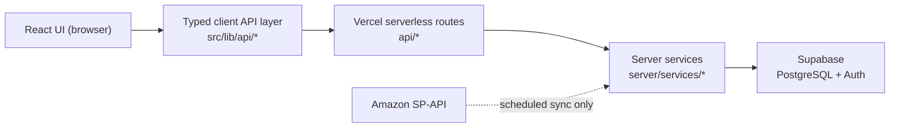

# SignMaster Web App

SignMaster is the companion web application for the **SignMaster 101 UK Road Sign Flashcards**
sold on Amazon UK. It lets a verified purchaser prove their Amazon order, create an account,
claim their product entitlement, and reach the protected app area.

The app is a React + Vite single-page frontend backed by Vercel serverless API routes and a
Supabase (PostgreSQL + Auth) database. Amazon Selling Partner API access is **server-side only**
and is never called during customer activation.

- **Production URL:** https://signmastercards.co.uk
- **Physical product activation URL:** inserts and cards in SignMaster packs direct customers to
  `https://signmastercards.co.uk/activate` — a fixed, query-free public entry point (no Amazon Order
  ID, user identity, token, entitlement, or per-pack identifier in the URL). Purchase verification
  happens server-side after the customer enters their Amazon Order ID. `/activate` is
  backwards-compatible; do not rename or remove it without a permanent redirect.
- **Deep architecture reference:** [`ARCHITECTURE.md`](./ARCHITECTURE.md)
- **Manual auth/activation acceptance pack:** [`docs/manual-auth-activation-acceptance.md`](./docs/manual-auth-activation-acceptance.md)
- **Pre-production checklist:** [`PRE_PRODUCTION_CHECKLIST.md`](./PRE_PRODUCTION_CHECKLIST.md)

> New here? Read [`ARCHITECTURE.md`](./ARCHITECTURE.md) first, then the
> [Quick start](#quick-start-from-a-fresh-clone) below.

---

## Current project status

Status is derived from the code and tests in this repository, not from a roadmap.

### Implemented

- **Amazon purchase verification** — `POST /api/activation/verify` checks an Amazon Order ID
  against the local order database (never live Amazon) and returns an eligibility status.
- **Activation context** — a server-issued, HttpOnly-cookie-backed context that carries a verified
  purchase across the sign-up / sign-in navigation (`/api/activation/context`).
- **Authentication** — Supabase Auth (email/password sign-up, sign-in, sessions).
- **Entitlement-aware protected access** — `/app` is gated by a server-authoritative entitlement
  check (`GET /api/entitlement/me`); the browser is never trusted to decide access.
- **Entitlement claim & activation completion** — `POST /api/activation/claim` and
  `POST /api/activation/complete`.
- **Cross-device activation continuation** — resume activation after email confirmation on a
  different device (`/api/activation/continuation`, `/api/activation/continue`).
- **Password recovery** — reset flow gated on a genuine Supabase `PASSWORD_RECOVERY` event.
- **Protected app area** — `/app` route behind entitlement resolution.

### Under development / intentionally deferred

- **Learner features (Quiz, Learn, Progress, Dashboard)** — **not yet built.** They are referenced
  as future scope in [`ARCHITECTURE.md`](./ARCHITECTURE.md) but are not implemented in this repo.
- **Server-side verify rate limiting / attempt caps** — **deferred to production hardening.** Not
  implemented yet; see the deferred note in
  [`docs/manual-auth-activation-acceptance.md`](./docs/manual-auth-activation-acceptance.md).
- **Cross-browser E2E (Firefox/WebKit)** — deferred; Playwright currently runs Chromium only.
- **CI** — GitHub Actions on **Node 24 LTS**: `npm ci`, Vitest, production build, Playwright Chromium E2E (desktop + mobile). Local **Node 26** is fine for Vitest thanks to the test Web Storage polyfill in `src/test/setup.ts`.

Do not treat deferred items as complete.

---

## Tech stack

Only technologies actually present in the repo are listed. Versions come from
[`package.json`](./package.json).

| Area | Technology |
|------|------------|
| UI framework | React 19 |
| Language | TypeScript ~5.7 |
| Build / dev server | Vite 6 |
| Styling | Tailwind CSS 3 + PostCSS / Autoprefixer |
| Routing | React Router 7 (`react-router-dom`) |
| Icons | lucide-react |
| Backend | Vercel Serverless Functions (`api/`) |
| Database / Auth | Supabase (`@supabase/supabase-js` 2, PostgreSQL + Supabase Auth) |
| Amazon integration | Amazon SP-API (server-side only) |
| Unit/component tests | Vitest 3 + React Testing Library |
| E2E tests | Playwright 1.62 (Chromium desktop + mobile) |
| Local Supabase CLI | `supabase` (dev dependency) |
| Local full-stack dev | `vercel` CLI (dev dependency) |

---

## Architecture overview

Requests flow one direction, and the browser never talks to Amazon or the database directly:



- **Authentication vs entitlement are separate.** Auth answers "who are you" (Supabase Auth);
  entitlement answers "are you allowed in" (the `app_entitlements` table). A user can be
  authenticated with no active entitlement.
- **Entitlement is server-authoritative.** `GET /api/entitlement/me` is bearer-only, queries with
  the service-role key, and returns a minimal status. The browser cannot self-grant access.
- **Activation continuity is server-held.** The verified-purchase context lives in an HttpOnly
  cookie / server row, not in browser-readable storage.

See [`ARCHITECTURE.md`](./ARCHITECTURE.md) for the full design, security model, and rationale.

### Repository structure

| Path | Contents |
|------|----------|
| `src/` | React frontend |
| `src/features/` | Feature modules: `activation/`, `account/`, `auth/`, `routing/` |
| `src/lib/api/` | Typed client API modules — the only place the UI calls `/api/*` |
| `src/lib/routing/` | Protected-route resolver state machine |
| `src/lib/supabase/` | Browser Supabase client + config |
| `src/components/` | Shared UI primitives and layout |
| `api/` | Vercel serverless HTTP handlers (`activation/*`, `entitlement/*`) |
| `server/services/` | Authoritative business logic (entitlement, claim, context, sync) |
| `server/amazon/` | Amazon SP-API client (server-only) |
| `server/supabase/` | Service-role Supabase client + request auth helpers |
| `server/scripts/` | Local dev/test helper scripts (fixtures, smoke tests, sync) |
| `supabase/` | Local Supabase config (`config.toml`) and SQL `migrations/` |
| `e2e/` | Playwright specs and mock helpers |
| `docs/` | Manual acceptance documentation |

---

## Prerequisites

| Tool | Version / notes | Verify |
|------|-----------------|--------|
| Node.js | 24 LTS for CI parity; local 24+ (26 supported for Vitest with repo test setup) | `node -v` |
| npm | Ships with Node | `npm -v` |
| Git | Any recent version | `git --version` |
| Docker | **Required** to run local Supabase (`supabase start` runs containers) | `docker --version` |

The Supabase CLI and Vercel CLI are installed as dev dependencies, so you run them with `npx`
(e.g. `npx supabase ...`) after `npm ci` — no global install required.

```bash
npx supabase --version
npx vercel --version
```

---

## Environment variables

The repo ships an [`.env.example`](./.env.example) with safe placeholders. Local development and
server scripts read `.env.local` (git-ignored). Copy the example and fill in values:

```bash
cp .env.example .env.local
```

**Never** put server secrets in `VITE_*` variables, and never commit real credentials.

### Browser-safe (bundled into the frontend — `VITE_` prefix)

| Variable | Purpose |
|----------|---------|
| `VITE_SUPABASE_URL` | Local Supabase API URL (e.g. `http://127.0.0.1:54321`) |
| `VITE_SUPABASE_ANON_KEY` | Supabase anon key (public, safe for the browser) |

### Server-only (never exposed to the browser)

| Variable | Purpose |
|----------|---------|
| `SUPABASE_URL` | Supabase API URL used by API routes and server scripts |
| `SUPABASE_SECRET_KEY` | Supabase **service-role** key — server-side only |
| `TARGET_ASIN` | ASIN the activation verifier treats as eligible |
| `SP_API_CLIENT_ID` | Amazon SP-API client id (sync only) |
| `SP_API_CLIENT_SECRET` | Amazon SP-API client secret (sync only) |
| `SP_API_REFRESH_TOKEN` | Amazon SP-API refresh token (sync only) |
| `SP_API_ENDPOINT` | Amazon SP-API endpoint (defaults to the EU endpoint) |
| `SP_API_MARKETPLACE_ID` | Amazon marketplace id (UK) |

> Amazon `SP_API_*` values are only needed for the scheduled sync scripts (`npm run sync:amazon`,
> `npm run test:amazon-*`). Local activation verification reads the local database, so a local
> full-stack run only needs the Supabase variables plus `TARGET_ASIN`.

---

## Local database setup (Supabase)

Local Supabase runs in Docker via the Supabase CLI. Configuration lives in
[`supabase/config.toml`](./supabase/config.toml); do not hardcode ports elsewhere.

### Start local Supabase

```bash
npx supabase start
```

This boots the local Postgres, Auth (GoTrue), Studio, and mail-testing containers, then prints the
local URLs and keys. Default ports from `config.toml`:

| Service | URL |
|---------|-----|
| API (PostgREST / Auth) | http://127.0.0.1:54321 |
| Postgres | `127.0.0.1:54322` |
| Studio (DB UI) | http://127.0.0.1:54323 |
| Email testing UI | http://127.0.0.1:54324 |

Copy the printed **API URL** into `VITE_SUPABASE_URL` / `SUPABASE_URL`, the **anon key** into
`VITE_SUPABASE_ANON_KEY`, and the **service_role key** into `SUPABASE_SECRET_KEY` in `.env.local`.

You can re-print these values any time:

```bash
npx supabase status
```

### Reset / migrate the database

```bash
npx supabase db reset
```

`db reset` drops the local database, recreates it, and re-applies every migration in
[`supabase/migrations/`](./supabase/migrations) in order. There is **no `supabase/seed.sql`** in
this repo, so `db reset` does not seed any application data — load local test data separately (see
[Local test data / activation fixtures](#local-test-data--activation-fixtures)).

Migration discipline:

- Migrations in `supabase/migrations/` are ordered, timestamp-prefixed SQL files and are treated as
  production code.
- **Do not casually edit an already-applied historical migration.** Make schema changes with a new
  migration:

  ```bash
  npx supabase migration new <descriptive_name>
  ```

- Migrations require review and extra care (see [Contribution workflow](#contribution-workflow)).

### Stop local Supabase

```bash
npx supabase stop
```

### Inspect the database

Open **Supabase Studio** at http://127.0.0.1:54323 to browse tables, run SQL, and inspect Auth
users.

### Database troubleshooting

| Symptom | Likely cause / fix |
|---------|--------------------|
| `supabase start` fails immediately | Docker is not running — start Docker and retry. |
| Port already in use (54321–54324) | Another Supabase instance or process holds the port. Run `npx supabase stop`, then `npx supabase start`. |
| Stale/hung containers | `npx supabase stop`, then `npx supabase start` again. |
| Migration fails on reset | Fix the offending migration SQL; re-run `npx supabase db reset`. |
| App calls hit remote instead of local | Confirm `VITE_SUPABASE_URL` / `SUPABASE_URL` point at `http://127.0.0.1:54321` in `.env.local`. |
| API routes 500 with auth/service errors | `SUPABASE_SECRET_KEY` (service-role key) missing from `.env.local`. |

---

## Starting the application locally

There are two local run modes. **They are not equivalent** — `/api/*` routes only run in the
full-stack mode.

| Command | What it serves | Serves `/api/*`? | Needs local Supabase? |
|---------|----------------|------------------|-----------------------|
| `npm run dev` | Vite frontend only, port **4200** | ❌ No | Depends on the work (see below) |
| `npm run dev:full` | Full stack via Vercel CLI, port **4200** | ✅ Yes | Yes |

`npm run dev` serves the frontend only and never serves `/api/*`. Whether it needs local Supabase
depends on what you are doing:

- **Pure / mock frontend work** (styling, layout, component behaviour, and the Playwright E2E suite,
  which mocks every API and Supabase Auth call) → **local Supabase is not required.**
- **Real auth testing** (actual sign-up, sign-in, password recovery, or any real Supabase Auth
  flow) → **local Supabase is required**, and `VITE_SUPABASE_URL` / `VITE_SUPABASE_ANON_KEY` must
  point at it (`npx supabase start`, values from `npx supabase status`).
- **Real `/api/*` backend testing** → use **`npm run dev:full`** (frontend + serverless routes),
  which also requires local Supabase and reads server secrets from `.env.local`.

### Quick start (from a fresh clone)

```bash
git clone https://github.com/tskaarthick/signmaster-web-app.git
cd signmaster-web-app
npm ci

# 1. Configure environment
cp .env.example .env.local

# 2. Start local Supabase (Docker required) and copy the printed URLs/keys into .env.local
npx supabase start
npx supabase db reset          # apply migrations to a clean DB

# 3a. Frontend only (no /api/* routes)
npm run dev                    # http://localhost:4200

# 3b. OR full stack (frontend + /api/* via Vercel CLI)
npm run dev:full               # http://localhost:4200
```

Both modes serve the app at **http://localhost:4200** (Vite uses `strictPort`, so port 4200 must be
free). No separate proxy is configured; a single process serves the app in each mode.

> Note: `npm run dev:full` requires Docker (for Supabase) and a populated `.env.local`. It was not
> executed inside the documentation sandbox because Docker is unavailable there; the command and its
> wiring are taken directly from [`package.json`](./package.json) and
> [`.env.example`](./.env.example).

---

## Recommended local workflow

1. `npx supabase start` (once per session; Docker running).
2. `npm run dev:full` for full-stack work, or `npm run dev` for pure UI work.
3. Make a small, scoped change.
4. Run focused tests (e.g. `npm run test:run` for the affected area, `npm run test:e2e` for flows).
5. Before opening a PR: `npm run test:run`, `npm run build`, focused Playwright where relevant,
   and `git diff --check` (full E2E runs in CI).
6. `npx supabase stop` when you are done.

---

## Test commands

| Purpose | Command |
|---------|---------|
| Unit + component + server tests (single run) | `npm run test:run` |
| Watch mode | `npm run test` |
| Coverage | `npm run test:coverage` |
| End-to-end (Playwright) | `npm run test:e2e` |
| End-to-end (headed) | `npm run test:e2e:headed` |
| Production build | `npm run build` |
| Whitespace / conflict-marker hygiene (pre-PR) | `git diff --check` |

### What the E2E suite does

- **Starts the app automatically.** Playwright's `webServer` runs `npm run dev` (Vite frontend only)
  on port 4200.
- **Mocks all `/api/*` and Supabase Auth endpoints.** E2E does **not** require local Supabase or the
  full-stack server.
- **Runs two viewports:** `chromium-desktop` (~1280px) and `chromium-mobile` (~375px).
- Firefox/WebKit are intentionally not run.

---

## Test strategy overview

- **Vitest + React Testing Library** — unit and component tests for the frontend (`src/**`).
- **Vitest (node)** — server/API/service tests for `server/**` and `api/**`.
- **Playwright** — end-to-end journey tests in `e2e/`, with all backend calls mocked.
- **Manual real-Supabase acceptance** — see
  [`docs/manual-auth-activation-acceptance.md`](./docs/manual-auth-activation-acceptance.md).

Mocked E2E cannot prove behaviour that depends on real infrastructure. It does **not** verify real
Supabase email-confirmation/`PASSWORD_RECOVERY` callbacks, HttpOnly cookie flags, database race /
uniqueness behaviour, RLS enforcement, or real session lifecycles. Those require manual acceptance
on a non-production Supabase project.

---

## Local test data / activation fixtures

Activation test fixtures are defined in
[`server/scripts/activationTestFixturesLocalHelpers.ts`](./server/scripts/activationTestFixturesLocalHelpers.ts).
They use **synthetic** Amazon Order IDs (never real customer data) and cover each verification
outcome:

| Order ID | Expected verify result |
|----------|------------------------|
| `000-0000000-0000000` | ELIGIBLE |
| `888-8888888-8888888` | ELIGIBLE |
| `777-7777777-7777777` | ELIGIBLE (partial return) |
| `222-2222222-2222222` | NOT_SHIPPED |
| `333-3333333-3333333` | ALREADY_CLAIMED |
| `444-4444444-4444444` | CANCELLED |
| `555-5555555-5555555` | RETURNED |
| `666-6666666-6666666` | NOT_FOUND (wrong product) |
| `111-1111111-1111111` | NOT_FOUND (absent order) |

These fixtures are **seeded into local Supabase** (they are real rows, not just Playwright mocks),
so they require a running local Supabase and `SUPABASE_SECRET_KEY` in `.env.local`:

| Purpose | Command |
|---------|---------|
| Seed fixtures into local Supabase | `npm run seed:activation-test-local` |
| Verify fixtures resolve as expected | `npm run verify:activation-test-local` |
| Remove fixtures | `npm run clean:activation-test-local` |

The cleanup script only ever touches the reserved synthetic Order IDs above. Never seed or expose
real customer Order IDs.

---

## Authentication and activation flow

Developer-level summary (full detail in [`ARCHITECTURE.md`](./ARCHITECTURE.md)):

```
Amazon order verification (/activate)
  → activation context issued (HttpOnly cookie / server row)
    → create account or sign in
      → email confirmation (if required; same-device or cross-device continuation)
        → entitlement claim
          → activation completion
            → /app (protected route, entitlement required)
```

Key invariants:

- The **browser never chooses** the user id or order authority; the server derives the authenticated
  user from the session.
- Activation context is held **server-side** in an HttpOnly cookie, not in browser-readable storage.
- Entitlement is **server-authoritative** via `GET /api/entitlement/me`.
- An **active entitlement is required** to view protected content; access is re-checked from the
  backend, not cached in the browser.

Routes (from [`src/App.tsx`](./src/App.tsx)): `/activate`, `/create-account`, `/sign-in`,
`/forgot-password`, `/reset-password`, `/app` (protected), `/activation/continue` (cross-device).

---

## Database schema overview

Defined in [`supabase/migrations/`](./supabase/migrations). One line each:

| Table | Purpose |
|-------|---------|
| `amazon_orders` | Synced Amazon order headers (fulfillment status, update timestamps). |
| `amazon_order_items` | Line items per order (ASIN, quantities ordered/fulfilled/returned). |
| `app_entitlements` | A user's claimed entitlement for an order (`active` / `revoked`); unique per order. |
| `activation_contexts` | Server-side verified-purchase context (hashed token, expiry) for auth continuity. |
| `activation_continuations` | Single-use, short-lived cross-device continuation references (hashed). |
| `sync_state` | Key/value checkpoints for the Amazon sync jobs. |

There is also a `consume_activation_continuation` PostgreSQL function that consumes a continuation
reference atomically.

**RLS / service-role boundary:** row-level security is enabled on all application tables. Writes are
granted to `service_role` only; authenticated users may `select` **only their own** rows in
`app_entitlements` (policy `app_entitlements_select_own`). API routes use the service-role key
server-side; the browser uses the anon key and cannot read order or sync tables.

---

## API overview

All routes live under `api/` and are served locally by `npm run dev:full`.

| Method | Route | Purpose |
|--------|-------|---------|
| `POST` | `/api/activation/verify` | Verify an Amazon Order ID against the local order DB. |
| `GET` / `POST` | `/api/activation/context` | Read / issue the server-side activation context. |
| `POST` | `/api/activation/claim` | Claim an entitlement for a verified order. |
| `POST` | `/api/activation/complete` | Finalise activation and clear the context. |
| `POST` | `/api/activation/continuation` | Mint a cross-device continuation reference. |
| `POST` | `/api/activation/continue` | Consume a continuation reference to resume activation. |
| `GET` | `/api/entitlement/me` | Server-authoritative entitlement status for the signed-in user. |

---

## Security rules for contributors

Verified against [`ARCHITECTURE.md`](./ARCHITECTURE.md) and `.cursor/rules/review-gate.mdc`:

- **Never** put server secrets (service-role key, Amazon credentials, cron secrets) in `VITE_*`
  variables or any browser-reachable code.
- **Never** use browser storage as an entitlement authority. Entitlement is decided server-side.
- The **browser must not decide user identity**; the server derives the authenticated user.
- Backend validates activation and entitlement; frontend validation is **UX only**.
- **No production customer data** in tests or fixtures — use the synthetic fixtures.
- **Do not log** secrets or raw backend errors to the browser.
- Server credentials stay **server-side** (Vercel environment variables in production).
- Keep `/api/*` calls out of React UI components; go through the typed client modules in
  `src/lib/api/`.

---

## Contribution workflow

```
branch  →  small scoped change  →  tests  →  build  →  git diff --check  →  PR  →  review  →  merge
```

- **Do not push directly to `main`.** Open a pull request; CI on **Node 24 LTS** runs
  `npm ci`, `npm run test:run`, `npm run build`, and Playwright Chromium E2E (`npm run test:e2e`).
  Local pre-PR checks usually match with `npm run test:run`, `npm run build`, and focused E2E —
  you do not need to replay the full CI job in Docker.
- Keep PR scope small and focused; do not refactor unrelated files.
- **Do not weaken, delete, or bypass existing tests** to make work pass.
- Every behaviour change should include appropriate automated tests.
- **Database migrations are production code** — they require review and extra care; prefer a new
  migration over editing an applied one.
- Auth / activation / entitlement changes must **preserve server authority** (see security rules).

---

## AI-agent contribution rules

- Read [`ARCHITECTURE.md`](./ARCHITECTURE.md) first, then inspect existing patterns before writing
  code.
- Keep scope tight; do not invent product or UX behaviour outside the task.
- No secrets in code or logs; no real customer data in tests.
- Do not weaken or delete tests.
- Report the files changed, tests run, and build results in your summary.
- Do not merge automatically.
- Treat database migrations as production code requiring review.

---

## Deployment

- **Hosting:** Vercel (static frontend + serverless functions in `api/`). Routing/rewrites are in
  [`vercel.json`](./vercel.json).
- **Build command:** `npm run build` (`tsc -b && vite build`).
- **Backend:** the same repo's `api/*` handlers deploy as Vercel serverless functions.
- **Database / Auth:** Supabase (PostgreSQL + Auth). Production secrets live only in Vercel
  environment variables.
- **Scheduled sync:** Amazon SP-API synchronisation runs server-side (never during customer
  activation).
- **Production URL:** https://signmastercards.co.uk

Do not place production secrets in this repository.

---

## Troubleshooting

| Symptom | Likely cause / fix |
|---------|--------------------|
| `npm ci` fails | Use Node 24+ locally (CI uses 24 LTS); run `npm ci` on your host OS after Docker installs (Rollup native binaries are platform-specific). |
| Supabase will not start | Docker is not running, or ports 54321–54324 are busy. Start Docker; `npx supabase stop` then `start`. |
| App loads but API calls fail | You are running `npm run dev` (frontend only). Use `npm run dev:full` for `/api/*`. |
| API routes return 500 (service errors) | `SUPABASE_SECRET_KEY` missing/incorrect in `.env.local`. |
| Local auth fails | Check `VITE_SUPABASE_URL` / `VITE_SUPABASE_ANON_KEY` match `npx supabase status` output. |
| Migrations fail | Fix migration SQL, then `npx supabase db reset`. |
| Playwright fails to start | Ensure port 4200 is free; run `npx playwright install` if browsers are missing. |
| Port 4200 already in use | Stop the process using it (Vite uses `strictPort`). |
| Frontend hitting remote/production Supabase | `VITE_SUPABASE_URL` points at a remote URL — set it back to `http://127.0.0.1:54321`. |

---

## Useful commands cheat sheet

| Task | Command |
|------|---------|
| Install dependencies | `npm ci` |
| Start local database | `npx supabase start` |
| Reset / migrate database | `npx supabase db reset` |
| Start app (frontend only) | `npm run dev` |
| Start app (full stack, `/api/*`) | `npm run dev:full` |
| Unit / component / server tests | `npm run test:run` |
| End-to-end tests | `npm run test:e2e` |
| Production build | `npm run build` |
| Pre-PR hygiene check | `git diff --check` |
| Seed local activation fixtures | `npm run seed:activation-test-local` |
| Stop local database | `npx supabase stop` |
